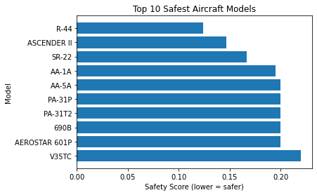
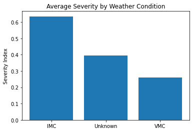
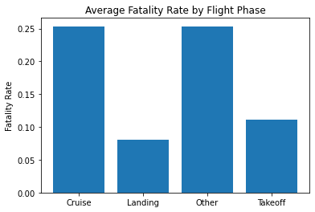

## Final Project Submission

Please fill out:
* Student name: JOHN AWALLAH OTHIM
* Student pace: part time
* Scheduled project review date/time: 
* Instructor name: BRIAN CHACHA
* Blog post URL:


## Objectives
1. Identify Low-risk aircraft Models for acquisition
2. Assess factors influencing Aircraft Safety and Reliability
3. Generate Data-Driven Business Recommendations to guide executives

## Loading the data
The first step is to load the data


```python
import pandas as pd
import csv
import numpy as np
df = pd.read_csv('Aviation_Data.csv')
```

    c:\Users\USER\anaconda3\envs\learn-env\lib\site-packages\IPython\core\interactiveshell.py:3145: DtypeWarning: Columns (6,7,28) have mixed types.Specify dtype option on import or set low_memory=False.
      has_raised = await self.run_ast_nodes(code_ast.body, cell_name,
    

## Exploring the data and its structure


```python
df.info()

```

    <class 'pandas.core.frame.DataFrame'>
    RangeIndex: 90348 entries, 0 to 90347
    Data columns (total 31 columns):
     #   Column                  Non-Null Count  Dtype  
    ---  ------                  --------------  -----  
     0   Event.Id                88889 non-null  object 
     1   Investigation.Type      90348 non-null  object 
     2   Accident.Number         88889 non-null  object 
     3   Event.Date              88889 non-null  object 
     4   Location                88837 non-null  object 
     5   Country                 88663 non-null  object 
     6   Latitude                34382 non-null  object 
     7   Longitude               34373 non-null  object 
     8   Airport.Code            50249 non-null  object 
     9   Airport.Name            52790 non-null  object 
     10  Injury.Severity         87889 non-null  object 
     11  Aircraft.damage         85695 non-null  object 
     12  Aircraft.Category       32287 non-null  object 
     13  Registration.Number     87572 non-null  object 
     14  Make                    88826 non-null  object 
     15  Model                   88797 non-null  object 
     16  Amateur.Built           88787 non-null  object 
     17  Number.of.Engines       82805 non-null  float64
     18  Engine.Type             81812 non-null  object 
     19  FAR.Description         32023 non-null  object 
     20  Schedule                12582 non-null  object 
     21  Purpose.of.flight       82697 non-null  object 
     22  Air.carrier             16648 non-null  object 
     23  Total.Fatal.Injuries    77488 non-null  float64
     24  Total.Serious.Injuries  76379 non-null  float64
     25  Total.Minor.Injuries    76956 non-null  float64
     26  Total.Uninjured         82977 non-null  float64
     27  Weather.Condition       84397 non-null  object 
     28  Broad.phase.of.flight   61724 non-null  object 
     29  Report.Status           82508 non-null  object 
     30  Publication.Date        73659 non-null  object 
    dtypes: float64(5), object(26)
    memory usage: 21.4+ MB
    

## Identifying the important columns
The important columns identified using keys()


```python
df.columns
#df.select_dtypes(include=['number']).columns
```


    Index(['Event.Id', 'Investigation.Type', 'Accident.Number', 'Event.Date',
           'Location', 'Country', 'Latitude', 'Longitude', 'Airport.Code',
           'Airport.Name', 'Injury.Severity', 'Aircraft.damage',
           'Aircraft.Category', 'Registration.Number', 'Make', 'Model',
           'Amateur.Built', 'Number.of.Engines', 'Engine.Type', 'FAR.Description',
           'Schedule', 'Purpose.of.flight', 'Air.carrier', 'Total.Fatal.Injuries',
           'Total.Serious.Injuries', 'Total.Minor.Injuries', 'Total.Uninjured',
           'Weather.Condition', 'Broad.phase.of.flight', 'Report.Status',
           'Publication.Date'],
          dtype='object')


## Based on the objectives, the following columns should be retained for analysis;

'Event.Id', 'Accident.Number', 'Event.Date','Make', 'Model', 'Aircraft.Category', 'Engine.Type', 'Number.of.Engines', 'Aircraft.damage', 'Injury.Severity', 'Total.Fatal.Injuries', 'Total.Serious.Injuries', 'Total.Minor.Injuries', 'Total.Uninjured', 'Purpose.of.flight', 'Weather.Condition', 'Broad.phase.of.flight', 'Location', 'Country', 'Latitude', 'Longitude', 'Air.carrier', 'FAR.Description', 'Report.Status', 'Publication.Date'

## Filter Data to only Relevant Columns


```python
Kept_columns = ['Event.Id', 'Accident.Number', 'Event.Date','Make', 'Model', 'Aircraft.Category', 'Engine.Type', 'Number.of.Engines', 'Aircraft.damage', 'Injury.Severity', 'Total.Fatal.Injuries', 'Total.Serious.Injuries', 'Total.Minor.Injuries', 'Total.Uninjured', 'Purpose.of.flight', 'Weather.Condition', 'Broad.phase.of.flight', 'Location', 'Country', 'Latitude', 'Longitude', 'Air.carrier', 'FAR.Description', 'Report.Status', 'Publication.Date']
df_filtered = df[Kept_columns]
```


```python
df_filtered.head()
```


<div>
<style scoped>
    .dataframe tbody tr th:only-of-type {
        vertical-align: middle;
    }

    .dataframe tbody tr th {
        vertical-align: top;
    }

    .dataframe thead th {
        text-align: right;
    }
</style>
<table border="1" class="dataframe">
  <thead>
    <tr style="text-align: right;">
      <th></th>
      <th>Event.Id</th>
      <th>Accident.Number</th>
      <th>Event.Date</th>
      <th>Make</th>
      <th>Model</th>
      <th>Aircraft.Category</th>
      <th>Engine.Type</th>
      <th>Number.of.Engines</th>
      <th>Aircraft.damage</th>
      <th>Injury.Severity</th>
      <th>...</th>
      <th>Weather.Condition</th>
      <th>Broad.phase.of.flight</th>
      <th>Location</th>
      <th>Country</th>
      <th>Latitude</th>
      <th>Longitude</th>
      <th>Air.carrier</th>
      <th>FAR.Description</th>
      <th>Report.Status</th>
      <th>Publication.Date</th>
    </tr>
  </thead>
  <tbody>
    <tr>
      <th>0</th>
      <td>20001218X45444</td>
      <td>SEA87LA080</td>
      <td>1948-10-24</td>
      <td>Stinson</td>
      <td>108-3</td>
      <td>NaN</td>
      <td>Reciprocating</td>
      <td>1.0</td>
      <td>Destroyed</td>
      <td>Fatal(2)</td>
      <td>...</td>
      <td>UNK</td>
      <td>Cruise</td>
      <td>MOOSE CREEK, ID</td>
      <td>United States</td>
      <td>NaN</td>
      <td>NaN</td>
      <td>NaN</td>
      <td>NaN</td>
      <td>Probable Cause</td>
      <td>NaN</td>
    </tr>
    <tr>
      <th>1</th>
      <td>20001218X45447</td>
      <td>LAX94LA336</td>
      <td>1962-07-19</td>
      <td>Piper</td>
      <td>PA24-180</td>
      <td>NaN</td>
      <td>Reciprocating</td>
      <td>1.0</td>
      <td>Destroyed</td>
      <td>Fatal(4)</td>
      <td>...</td>
      <td>UNK</td>
      <td>Unknown</td>
      <td>BRIDGEPORT, CA</td>
      <td>United States</td>
      <td>NaN</td>
      <td>NaN</td>
      <td>NaN</td>
      <td>NaN</td>
      <td>Probable Cause</td>
      <td>19-09-1996</td>
    </tr>
    <tr>
      <th>2</th>
      <td>20061025X01555</td>
      <td>NYC07LA005</td>
      <td>1974-08-30</td>
      <td>Cessna</td>
      <td>172M</td>
      <td>NaN</td>
      <td>Reciprocating</td>
      <td>1.0</td>
      <td>Destroyed</td>
      <td>Fatal(3)</td>
      <td>...</td>
      <td>IMC</td>
      <td>Cruise</td>
      <td>Saltville, VA</td>
      <td>United States</td>
      <td>36.9222</td>
      <td>-81.8781</td>
      <td>NaN</td>
      <td>NaN</td>
      <td>Probable Cause</td>
      <td>26-02-2007</td>
    </tr>
    <tr>
      <th>3</th>
      <td>20001218X45448</td>
      <td>LAX96LA321</td>
      <td>1977-06-19</td>
      <td>Rockwell</td>
      <td>112</td>
      <td>NaN</td>
      <td>Reciprocating</td>
      <td>1.0</td>
      <td>Destroyed</td>
      <td>Fatal(2)</td>
      <td>...</td>
      <td>IMC</td>
      <td>Cruise</td>
      <td>EUREKA, CA</td>
      <td>United States</td>
      <td>NaN</td>
      <td>NaN</td>
      <td>NaN</td>
      <td>NaN</td>
      <td>Probable Cause</td>
      <td>12-09-2000</td>
    </tr>
    <tr>
      <th>4</th>
      <td>20041105X01764</td>
      <td>CHI79FA064</td>
      <td>1979-08-02</td>
      <td>Cessna</td>
      <td>501</td>
      <td>NaN</td>
      <td>NaN</td>
      <td>NaN</td>
      <td>Destroyed</td>
      <td>Fatal(1)</td>
      <td>...</td>
      <td>VMC</td>
      <td>Approach</td>
      <td>Canton, OH</td>
      <td>United States</td>
      <td>NaN</td>
      <td>NaN</td>
      <td>NaN</td>
      <td>NaN</td>
      <td>Probable Cause</td>
      <td>16-04-1980</td>
    </tr>
  </tbody>
</table>
<p>5 rows × 25 columns</p>
</div>


```python
available = [c for c in Kept_columns if c in df_filtered.columns]
df_filtered = df_filtered[available].copy()
```


```python
for x in ['Event.Date', 'Publication.Date']:
    if x in df_filtered:
        df_filtered[x] = pd.to_datetime(df_filtered[x], errors= 'coerce')
```

## DATA CLEANING

## Identify numerical columns and make sure they are numeric


```python
numerical_columns = ['Total.Fatal.Injuries', 'Total.Serious.Injuries', 'Total.Minor.Injuries', 'Total.Uninjured', 'Number.of.Engines', 'Latitude', 'Longitude']
print(numerical_columns)
```

    ['Total.Fatal.Injuries', 'Total.Serious.Injuries', 'Total.Minor.Injuries', 'Total.Uninjured', 'Number.of.Engines', 'Latitude', 'Longitude']
    


```python
for x in [x for x in numerical_columns if x in df_filtered.columns]:
    df_filtered[x] = pd.to_numeric(df_filtered[x], errors='coerce')
df_filtered[numerical_columns].dtypes
```


    Total.Fatal.Injuries      float64
    Total.Serious.Injuries    float64
    Total.Minor.Injuries      float64
    Total.Uninjured           float64
    Number.of.Engines         float64
    Latitude                  float64
    Longitude                 float64
    dtype: object


## Text Columns Cleaning


```python
cat_columns = ['Make', 'Model', 'Aircraft.Category', 'Engine.Type', 'Aircraft.damage', 'Injury.Severity', 'Purpose.of.flight', 'Weather.Condition', 'Broad.phase.of.flight', 'Location', 'Country', 'Air.carrier', 'FAR.Description', 'Report.Status']
for x in [x for x in cat_columns if x in df_filtered]:
    df_filtered[x] = (df_filtered[x].astype(str).str.strip()
             .replace({'nan': '', 'None':'', 'NaN': ''}, regex=False))
    df_filtered[x] = df_filtered[x].replace('', np.nan).fillna('Unknown')
```

## removal of Duplicates


```python
event_columns = [x for x in ['Event.Id', 'Accident.Number'] if x in df_filtered]
if event_columns:
    df_filtered = df_filtered.drop_duplicates(subset=event_columns)
```

Fill in missing values


```python
for x in ['Total.Fatal.Injuries', 'Total.Serious.Injuries', 'Total.Minor.Injuries', 'Total.Uninjured']:
    if x in df_filtered.columns:
        df_filtered[x] = df_filtered[x].fillna(0)

#Missing number of engines
if 'Number.of.Engines' in df_filtered.columns:
    df_filtered['Number.of.Engines'] = (
        df_filtered.groupby('Model', dropna=False)['Number.of.Engines']
        .transform(lambda g:g.fillna(g.median()))
    )
    global_median = df_filtered['Number.of.Engines'].median()
    df_filtered['Number.of.Engines'] = df_filtered['Number.of.Engines'].fillna(global_median)
```

    c:\Users\USER\anaconda3\envs\learn-env\lib\site-packages\numpy\lib\nanfunctions.py:1113: RuntimeWarning: Mean of empty slice
      return np.nanmean(a, axis, out=out, keepdims=keepdims)
    


```python
df_filtered[['Total.Fatal.Injuries', 'Total.Serious.Injuries', 'Total.Minor.Injuries', 'Total.Uninjured', 'Number.of.Engines']].isna().sum()
```


    Total.Fatal.Injuries      0
    Total.Serious.Injuries    0
    Total.Minor.Injuries      0
    Total.Uninjured           0
    Number.of.Engines         0
    dtype: int64


## DATA ANALYSIS
# Creating fatality and survival rates
This are metrics to help rank the aircraft models on the basis of their safety


```python
#Creating a new column of total persons involved in each event
cols = ['Total.Fatal.Injuries', 'Total.Serious.Injuries', 'Total.Minor.Injuries', 'Total.Uninjured']
#sum across those columns
df_filtered['Total.People'] = df_filtered[cols].sum(axis=1, min_count=1)

#df_filtered['Total.People'] = (
    #df_filtered['Total.Fatal.Injuries'] + df_filtered['Total.Serious.Injuries']
    #+ df_filtered['Total.Minor.Injuries'] + df_filtered['Total.Uninjured']
#)
```


```python
df_filtered['Total.People'] = df_filtered['Total.People'].replace(0, np.nan)
```


```python
print(df_filtered.columns)
```

    Index(['Event.Id', 'Accident.Number', 'Event.Date', 'Make', 'Model',
           'Aircraft.Category', 'Engine.Type', 'Number.of.Engines',
           'Aircraft.damage', 'Injury.Severity', 'Total.Fatal.Injuries',
           'Total.Serious.Injuries', 'Total.Minor.Injuries', 'Total.Uninjured',
           'Purpose.of.flight', 'Weather.Condition', 'Broad.phase.of.flight',
           'Location', 'Country', 'Latitude', 'Longitude', 'Air.carrier',
           'FAR.Description', 'Report.Status', 'Publication.Date', 'Total.People'],
          dtype='object')
    


```python
#denominator (avoid divide-by-zero and non-numeric issues)
den = pd.to_numeric(df_filtered['Total.People'], errors='coerce')
fatal = pd.to_numeric(df_filtered['Total.Fatal.Injuries'], errors='coerce')
uninjured = pd.to_numeric(df_filtered['Total.Uninjured'], errors='coerce')
```


```python
df_filtered['Fatality.Rate'] = np.divide(
    fatal, den, out=np.full(den.shape, np.nan, dtype='float64'), where=den>0
)
df_filtered['Survival.Rate'] = np.divide(
    uninjured, den, out=np.full(den.shape, np.nan, dtype='float64'), where=den>0
)
df_filtered[['Fatality.Rate', 'Survival.Rate']] = (
    df_filtered[['Fatality.Rate', 'Survival.Rate']]
    .replace([np.inf, -np.inf], np.nan)
    .clip(0, 1)
)
```

# Summary of the severity of the accident


```python
Accident_weights = (
    3*df_filtered['Total.Fatal.Injuries'] +
    2*df_filtered['Total.Serious.Injuries']+
    1*df_filtered['Total.Minor.Injuries']
)
df_filtered['Severity.Index'] = np.where(
    den > 0,
    Accident_weights/(3 * den),
    np.nan
)
df_filtered['Severity.Index'] = (
    df_filtered['Severity.Index']
    .replace([np.inf, -np.inf], np.nan)
    .fillna(0)
)
#df_filtered['Severity.Index'] = (Accident_weights/ (3*df_filtered['Total.People'])).fillna(0)
```

# Effect of weather conditions


```python
wc = df_filtered['Weather.Condition'].str.lower()
df_filtered['Weather.Clean'] = np.select(
    [
        wc.str.contains('imc|instrument', na=False),
        wc.str.contains('snow|rain|storm|wind|fog|icing|hail|microburst', na=False),
        wc.str.contains('vmc|visual|clear', na=False)
    ],
    ['IMC', 'Adverse', 'VMC'],
    default='Unknown'
)
```

## Flight Phase Realignment
This will help highlight when most flight incidents occur


```python
fp = df_filtered['Broad.phase.of.flight'].str.lower()
df_filtered['Phase.Group'] = np.select(
    [
        fp.str.contains('takeoff|initial climb|taxi', na=False),
        fp.str.contains('approach|landing|flare|go-around', na=False),
        fp.str.contains('enroute|cruise', na=False)
    ],
    ['Takeoff', 'Landing', 'Cruise'],
    default='Other'
)
```

## Trend Analysis of Time of the Event
Extract year to show trend


```python
df_filtered['Event.Year'] = df_filtered['Event.Date'].dt.year
```


```python
df_filtered[['Make', 'Model', 'Fatality.Rate', 'Survival.Rate', 'Severity.Index', 'Weather.Clean', 'Phase.Group', 'Event.Year']].head()
```


<div>
<style scoped>
    .dataframe tbody tr th:only-of-type {
        vertical-align: middle;
    }

    .dataframe tbody tr th {
        vertical-align: top;
    }

    .dataframe thead th {
        text-align: right;
    }
</style>
<table border="1" class="dataframe">
  <thead>
    <tr style="text-align: right;">
      <th></th>
      <th>Make</th>
      <th>Model</th>
      <th>Fatality.Rate</th>
      <th>Survival.Rate</th>
      <th>Severity.Index</th>
      <th>Weather.Clean</th>
      <th>Phase.Group</th>
      <th>Event.Year</th>
    </tr>
  </thead>
  <tbody>
    <tr>
      <th>0</th>
      <td>Stinson</td>
      <td>108-3</td>
      <td>1.000000</td>
      <td>0.0</td>
      <td>1.000000</td>
      <td>Unknown</td>
      <td>Cruise</td>
      <td>1948.0</td>
    </tr>
    <tr>
      <th>1</th>
      <td>Piper</td>
      <td>PA24-180</td>
      <td>1.000000</td>
      <td>0.0</td>
      <td>1.000000</td>
      <td>Unknown</td>
      <td>Other</td>
      <td>1962.0</td>
    </tr>
    <tr>
      <th>2</th>
      <td>Cessna</td>
      <td>172M</td>
      <td>1.000000</td>
      <td>0.0</td>
      <td>1.000000</td>
      <td>IMC</td>
      <td>Cruise</td>
      <td>1974.0</td>
    </tr>
    <tr>
      <th>3</th>
      <td>Rockwell</td>
      <td>112</td>
      <td>1.000000</td>
      <td>0.0</td>
      <td>1.000000</td>
      <td>IMC</td>
      <td>Cruise</td>
      <td>1977.0</td>
    </tr>
    <tr>
      <th>4</th>
      <td>Cessna</td>
      <td>501</td>
      <td>0.333333</td>
      <td>0.0</td>
      <td>0.777778</td>
      <td>VMC</td>
      <td>Landing</td>
      <td>1979.0</td>
    </tr>
  </tbody>
</table>
</div>


In order to answer the first objective; Identifying low-risk aircraft models for acquisition, we need to compute the safety metrics per aircraft model using average fatality rate, average severity, and count of incidents per model


```python
for col in ['Fatality.Rate', 'Severity.Index', 'Survival.Rate']:
    df_filtered[col] = pd.to_numeric(df_filtered[col], errors='coerce')
#Group by model
model_summary = (
    df_filtered.groupby(['Make', 'Model'])
    .agg(
        Accidents = ('Event.Id', 'count'),
        Avg_Fatality_Rate = ('Fatality.Rate', 'mean'),
        Avg_Severity = ('Severity.Index', 'mean'),
        Avg_Survival_Rate = ('Survival.Rate', 'mean')
    )
    .reset_index()
)
```


```python
#Include a safety score
model_summary['Safety.Score'] = 1- (
    model_summary['Avg_Fatality_Rate'] * 0.6 + 
    model_summary['Avg_Severity'] * 0.4
)
```

Exclude events with few incidents (<5)


```python
model_summary = model_summary[model_summary['Accidents'] >= 5]
```

Ranking the models by safety


```python
safest_models = model_summary.sort_values('Safety.Score', ascending=True)
safest_models.head(10)
```


<div>
<style scoped>
    .dataframe tbody tr th:only-of-type {
        vertical-align: middle;
    }

    .dataframe tbody tr th {
        vertical-align: top;
    }

    .dataframe thead th {
        text-align: right;
    }
</style>
<table border="1" class="dataframe">
  <thead>
    <tr style="text-align: right;">
      <th></th>
      <th>Make</th>
      <th>Model</th>
      <th>Accidents</th>
      <th>Avg_Fatality_Rate</th>
      <th>Avg_Severity</th>
      <th>Avg_Survival_Rate</th>
      <th>Safety.Score</th>
    </tr>
  </thead>
  <tbody>
    <tr>
      <th>15926</th>
      <td>ROBINSON</td>
      <td>R-44</td>
      <td>7</td>
      <td>0.857143</td>
      <td>0.904762</td>
      <td>0.000000</td>
      <td>0.123810</td>
    </tr>
    <tr>
      <th>15572</th>
      <td>Pterodactyl</td>
      <td>ASCENDER II</td>
      <td>5</td>
      <td>0.800000</td>
      <td>0.933333</td>
      <td>0.000000</td>
      <td>0.146667</td>
    </tr>
    <tr>
      <th>5296</th>
      <td>CIRRUS</td>
      <td>SR-22</td>
      <td>6</td>
      <td>0.833333</td>
      <td>0.833333</td>
      <td>0.166667</td>
      <td>0.166667</td>
    </tr>
    <tr>
      <th>465</th>
      <td>AMERICAN AVIATION</td>
      <td>AA-1A</td>
      <td>7</td>
      <td>0.833333</td>
      <td>0.761905</td>
      <td>0.000000</td>
      <td>0.195238</td>
    </tr>
    <tr>
      <th>9345</th>
      <td>GULFSTREAM AMERICAN CORP</td>
      <td>AA-5A</td>
      <td>5</td>
      <td>0.800000</td>
      <td>0.800000</td>
      <td>0.200000</td>
      <td>0.200000</td>
    </tr>
    <tr>
      <th>15192</th>
      <td>Piper</td>
      <td>PA-31T2</td>
      <td>5</td>
      <td>0.800000</td>
      <td>0.800000</td>
      <td>0.200000</td>
      <td>0.200000</td>
    </tr>
    <tr>
      <th>14395</th>
      <td>PIPER</td>
      <td>PA-31P</td>
      <td>5</td>
      <td>0.800000</td>
      <td>0.800000</td>
      <td>0.200000</td>
      <td>0.200000</td>
    </tr>
    <tr>
      <th>15990</th>
      <td>ROCKWELL INTERNATIONAL</td>
      <td>690B</td>
      <td>5</td>
      <td>0.800000</td>
      <td>0.800000</td>
      <td>0.200000</td>
      <td>0.200000</td>
    </tr>
    <tr>
      <th>17121</th>
      <td>SMITH</td>
      <td>AEROSTAR 601P</td>
      <td>5</td>
      <td>0.800000</td>
      <td>0.800000</td>
      <td>0.200000</td>
      <td>0.200000</td>
    </tr>
    <tr>
      <th>3397</th>
      <td>Beech</td>
      <td>V35TC</td>
      <td>5</td>
      <td>0.700000</td>
      <td>0.900000</td>
      <td>0.000000</td>
      <td>0.220000</td>
    </tr>
  </tbody>
</table>
</div>


## Visual Presentation


```python
import matplotlib.pyplot as plt

top = model_summary.nsmallest(10, 'Safety.Score')
plt.barh(top['Model'], top['Safety.Score'])
plt.xlabel('Safety Score (lower = safer)')
plt.ylabel('Model')
plt.title('Top 10 Safest Aircraft Models')
plt.gca().invert_yaxis()
plt.show()
```


    

    


```python
print(top['Safety.Score'])
```

    15926    0.123810
    15572    0.146667
    5296     0.166667
    465      0.195238
    9345     0.200000
    14395    0.200000
    15192    0.200000
    15990    0.200000
    17121    0.200000
    3397     0.220000
    Name: Safety.Score, dtype: float64
    

In order to answer the second objective; Assess the key factors influencing aircraft safety and reliability, determine the relationship between accident severity/fatality rate and other variables such as weather, flight phase, and purpose of flight


```python
#Determine which factors influence severity the most
#Compute average fatality and severity by the integral factors
#Start by weather;
Weather_Summary = (
    df_filtered.groupby('Weather.Clean')
    .agg(
        Accidents = ('Event.Id', 'count'),
        Avg_Fatality = ('Fatality.Rate', 'mean'),
        Avg_Severity = ('Severity.Index', 'mean')
    )
    .reset_index()
)
print(Weather_Summary)
```

      Weather.Clean  Accidents  Avg_Fatality  Avg_Severity
    0           IMC       5976      0.549193      0.635037
    1       Unknown       5599      0.431067      0.394443
    2           VMC      77288      0.141422      0.260170
    


```python
#Phase of Flight
Phase_Summary = (
    df_filtered.groupby('Phase.Group')
    .agg(
        Accidents = ('Event.Id', 'count'),
        Avg_Fatality = ('Fatality.Rate', 'mean'),
        Avg_Severity = ('Severity.Index', 'mean')
    )
    .reset_index()
)
print(Phase_Summary)
```

      Phase.Group  Accidents  Avg_Fatality  Avg_Severity
    0      Cruise      10269      0.252689      0.370427
    1     Landing      23327      0.080127      0.168607
    2       Other      40816      0.253599      0.365728
    3     Takeoff      14451      0.111613      0.238525
    


```python
#Purpose of flight
Purpose_Summary = (
    df_filtered.groupby('Purpose.of.flight')
    .agg(
        Accidents = ('Event.Id', 'count'),
        Avg_Fatality = ('Fatality.Rate', 'mean'),
        Avg_Severity = ('Severity.Index', 'mean')
    )
    .reset_index()
    .sort_values('Avg_Fatality', ascending=False)
)
print(Purpose_Summary.head(10))
```

          Purpose.of.flight  Accidents  Avg_Fatality  Avg_Severity
    0                  ASHO          5      0.600000      0.733333
    5         Air Race/show         59      0.426554      0.600274
    11         Firefighting         40      0.425000      0.543056
    4         Air Race show         99      0.363636      0.488215
    13           Glider Tow         53      0.245283      0.420335
    2    Aerial Observation        794      0.243165      0.400012
    7              Business       4015      0.242290      0.338644
    25              Unknown      12983      0.228770      0.274030
    3              Air Drop         11      0.227778      0.365320
    8   Executive/corporate        553      0.220475      0.294923
    

## Visual presentation


```python
import matplotlib.pyplot as plt
#Weather vs Severity
plt.bar(Weather_Summary['Weather.Clean'], Weather_Summary['Avg_Severity'])
plt.title('Average Severity by Weather Condition')
plt.ylabel('Severity Index')
plt.show()

#Phase vs Fatality
plt.bar(Phase_Summary['Phase.Group'], Phase_Summary['Avg_Fatality'])
plt.title('Average Fatality Rate by Flight Phase')
plt.ylabel('Fatality Rate')
plt.show()
```


    

    


    

    


## Proposed List of Possible Models to acquire


```python
#Focus should be on events that occured most recently
latest = df_filtered[df_filtered['Event.Year'] >= 2005].copy()
```


```python
#Compute new safety summary based on latest data
latest_summary = (
    latest.groupby(['Make', 'Model'])
        .agg(
            Accidents = ('Event.Id', 'count'),
            Avg_Fatality_Rate = ('Fatality.Rate', 'mean'),
            Avg_Severity = ('Severity.Index', 'mean')
        )
        .reset_index()
)
latest_summary['Safety.Score'] = 0.6 * latest_summary['Avg_Fatality_Rate'] + 0.4 * latest_summary['Avg_Severity']
```


```python
Proposed_List = (
    latest_summary
        .query('Accidents >= 5')
        .query('Avg_Fatality_Rate <= 0.05')
        .query('Avg_Severity <= 0.25')
        .sort_values('Safety.Score', ascending=True)
)
Proposed_List.head(10)
```


<div>
<style scoped>
    .dataframe tbody tr th:only-of-type {
        vertical-align: middle;
    }

    .dataframe tbody tr th {
        vertical-align: top;
    }

    .dataframe thead th {
        text-align: right;
    }
</style>
<table border="1" class="dataframe">
  <thead>
    <tr style="text-align: right;">
      <th></th>
      <th>Make</th>
      <th>Model</th>
      <th>Accidents</th>
      <th>Avg_Fatality_Rate</th>
      <th>Avg_Severity</th>
      <th>Safety.Score</th>
    </tr>
  </thead>
  <tbody>
    <tr>
      <th>2299</th>
      <td>Boeing</td>
      <td>747</td>
      <td>8</td>
      <td>0.0</td>
      <td>0.0</td>
      <td>0.0</td>
    </tr>
    <tr>
      <th>4215</th>
      <td>EMBRAER</td>
      <td>EMB145</td>
      <td>8</td>
      <td>0.0</td>
      <td>0.0</td>
      <td>0.0</td>
    </tr>
    <tr>
      <th>8615</th>
      <td>Robinson</td>
      <td>R-22 Beta II</td>
      <td>5</td>
      <td>0.0</td>
      <td>0.0</td>
      <td>0.0</td>
    </tr>
    <tr>
      <th>6842</th>
      <td>Maule</td>
      <td>MX7</td>
      <td>5</td>
      <td>0.0</td>
      <td>0.0</td>
      <td>0.0</td>
    </tr>
    <tr>
      <th>8438</th>
      <td>ROCKWELL INTERNATIONAL</td>
      <td>114</td>
      <td>9</td>
      <td>0.0</td>
      <td>0.0</td>
      <td>0.0</td>
    </tr>
    <tr>
      <th>3907</th>
      <td>DIAMOND AIRCRAFT IND INC</td>
      <td>DA 20 C1</td>
      <td>11</td>
      <td>0.0</td>
      <td>0.0</td>
      <td>0.0</td>
    </tr>
    <tr>
      <th>8047</th>
      <td>Piper</td>
      <td>PA38</td>
      <td>5</td>
      <td>0.0</td>
      <td>0.0</td>
      <td>0.0</td>
    </tr>
    <tr>
      <th>7916</th>
      <td>Piper</td>
      <td>PA-20</td>
      <td>8</td>
      <td>0.0</td>
      <td>0.0</td>
      <td>0.0</td>
    </tr>
    <tr>
      <th>2261</th>
      <td>Boeing</td>
      <td>717-200</td>
      <td>8</td>
      <td>0.0</td>
      <td>0.0</td>
      <td>0.0</td>
    </tr>
    <tr>
      <th>4936</th>
      <td>GREAT LAKES</td>
      <td>2T-1A-2</td>
      <td>6</td>
      <td>0.0</td>
      <td>0.0</td>
      <td>0.0</td>
    </tr>
  </tbody>
</table>
</div>


Operations and Training conditions


```python
#weather risk by model
weather_risk = (
    df_filtered.groupby(['Make', 'Model', 'Weather.Clean'])
        .agg(Avg_Severity = ('Severity.Index', 'mean'), Accidents = ('Event.Id', 'count'))
        .reset_index()
)
#Phase risk by model
Phase_Risk = (
    df_filtered.groupby(['Make', 'Model', 'Phase.Group'])
        .agg(Avg_Severity =('Severity.Index', 'mean'), Accidents = ('Event.Id', 'count'))
        .reset_index()
)
```


```python
# Merge core safety with simple risk notes
def risk_note(row):
    if row['Avg_Fatality_Rate'] <= 0.02 and row['Avg_Severity'] <= 0.20:
        return "Strong safety record; good acquisition candidate."
    if row['Avg_Fatality_Rate'] <= 0.05 and row['Avg_Severity'] <= 0.25:
        return "Acceptable safety; proceed with ops safeguards."
    return "Higher risk; prefer alternatives or require strong mitigations."

recs = Proposed_List.copy()
recs['Recommendation'] = recs.apply(risk_note, axis=1)

# Optional: attach quick context from weather/phase (top risk buckets)
w_ctx = (weather_risk.sort_values(['Make','Model','Avg_Severity'], ascending=[True,True,False])
                   .groupby(['Make','Model']).head(1)
                   .rename(columns={'Weather.Clean':'Top.Weather.Risk',
                                    'Avg_Severity':'Weather.Risk.Severity'}))

p_ctx = (Phase_Risk.sort_values(['Make','Model','Avg_Severity'], ascending=[True,True,False])
                  .groupby(['Make','Model']).head(1)
                  .rename(columns={'Phase.Group':'Top.Phase.Risk',
                                   'Avg_Severity':'Phase.Risk.Severity'}))

recs = (recs.merge(w_ctx[['Make','Model','Top.Weather.Risk','Weather.Risk.Severity']],
                   on=['Make','Model'], how='left')
 .merge(p_ctx[['Make','Model','Top.Phase.Risk','Phase.Risk.Severity']],
                   on=['Make','Model'], how='left'))

recs[['Make','Model','Accidents','Avg_Fatality_Rate','Avg_Severity','Safety.Score',
      'Top.Weather.Risk','Top.Phase.Risk','Recommendation']].head(10)
```


<div>
<style scoped>
    .dataframe tbody tr th:only-of-type {
        vertical-align: middle;
    }

    .dataframe tbody tr th {
        vertical-align: top;
    }

    .dataframe thead th {
        text-align: right;
    }
</style>
<table border="1" class="dataframe">
  <thead>
    <tr style="text-align: right;">
      <th></th>
      <th>Make</th>
      <th>Model</th>
      <th>Accidents</th>
      <th>Avg_Fatality_Rate</th>
      <th>Avg_Severity</th>
      <th>Safety.Score</th>
      <th>Top.Weather.Risk</th>
      <th>Top.Phase.Risk</th>
      <th>Recommendation</th>
    </tr>
  </thead>
  <tbody>
    <tr>
      <th>0</th>
      <td>Boeing</td>
      <td>747</td>
      <td>8</td>
      <td>0.0</td>
      <td>0.0</td>
      <td>0.0</td>
      <td>Unknown</td>
      <td>Cruise</td>
      <td>Strong safety record; good acquisition candidate.</td>
    </tr>
    <tr>
      <th>1</th>
      <td>EMBRAER</td>
      <td>EMB145</td>
      <td>8</td>
      <td>0.0</td>
      <td>0.0</td>
      <td>0.0</td>
      <td>IMC</td>
      <td>Other</td>
      <td>Strong safety record; good acquisition candidate.</td>
    </tr>
    <tr>
      <th>2</th>
      <td>Robinson</td>
      <td>R-22 Beta II</td>
      <td>5</td>
      <td>0.0</td>
      <td>0.0</td>
      <td>0.0</td>
      <td>VMC</td>
      <td>Landing</td>
      <td>Strong safety record; good acquisition candidate.</td>
    </tr>
    <tr>
      <th>3</th>
      <td>Maule</td>
      <td>MX7</td>
      <td>5</td>
      <td>0.0</td>
      <td>0.0</td>
      <td>0.0</td>
      <td>VMC</td>
      <td>Other</td>
      <td>Strong safety record; good acquisition candidate.</td>
    </tr>
    <tr>
      <th>4</th>
      <td>ROCKWELL INTERNATIONAL</td>
      <td>114</td>
      <td>9</td>
      <td>0.0</td>
      <td>0.0</td>
      <td>0.0</td>
      <td>IMC</td>
      <td>Other</td>
      <td>Strong safety record; good acquisition candidate.</td>
    </tr>
    <tr>
      <th>5</th>
      <td>DIAMOND AIRCRAFT IND INC</td>
      <td>DA 20 C1</td>
      <td>11</td>
      <td>0.0</td>
      <td>0.0</td>
      <td>0.0</td>
      <td>VMC</td>
      <td>Other</td>
      <td>Strong safety record; good acquisition candidate.</td>
    </tr>
    <tr>
      <th>6</th>
      <td>Piper</td>
      <td>PA38</td>
      <td>5</td>
      <td>0.0</td>
      <td>0.0</td>
      <td>0.0</td>
      <td>VMC</td>
      <td>Cruise</td>
      <td>Strong safety record; good acquisition candidate.</td>
    </tr>
    <tr>
      <th>7</th>
      <td>Piper</td>
      <td>PA-20</td>
      <td>8</td>
      <td>0.0</td>
      <td>0.0</td>
      <td>0.0</td>
      <td>VMC</td>
      <td>Other</td>
      <td>Strong safety record; good acquisition candidate.</td>
    </tr>
    <tr>
      <th>8</th>
      <td>Boeing</td>
      <td>717-200</td>
      <td>8</td>
      <td>0.0</td>
      <td>0.0</td>
      <td>0.0</td>
      <td>VMC</td>
      <td>Landing</td>
      <td>Strong safety record; good acquisition candidate.</td>
    </tr>
    <tr>
      <th>9</th>
      <td>GREAT LAKES</td>
      <td>2T-1A-2</td>
      <td>6</td>
      <td>0.0</td>
      <td>0.0</td>
      <td>0.0</td>
      <td>VMC</td>
      <td>Other</td>
      <td>Strong safety record; good acquisition candidate.</td>
    </tr>
  </tbody>
</table>
</div>


```python

```
