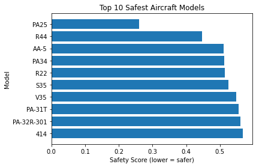
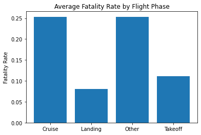
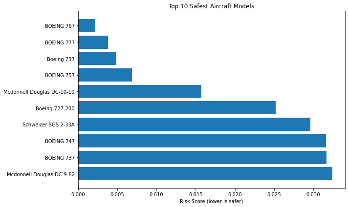

## Final Project Submission

Please fill out:
* Student name: JOHN AWALLAH OTHIM
* Student pace: part time
* Scheduled project review date/time: 
* Instructor name: BRIAN CHACHA
* Blog post URL:


## Objectives
1. Identify Low-risk aircraft Models for acquisition
2. Assess factors influencing Aircraft Safety and Reliability
3. Generate Data-Driven Business Recommendations to guide executives

## Loading the data
The first step is to load the data


```python
import pandas as pd
import csv
import numpy as np
df = pd.read_csv('Aviation_Data.csv')
```

## Exploring the data and its structure


```python
df.info()

```

    <class 'pandas.core.frame.DataFrame'>
    RangeIndex: 90348 entries, 0 to 90347
    Data columns (total 31 columns):
     #   Column                  Non-Null Count  Dtype  
    ---  ------                  --------------  -----  
     0   Event.Id                88889 non-null  object 
     1   Investigation.Type      90348 non-null  object 
     2   Accident.Number         88889 non-null  object 
     3   Event.Date              88889 non-null  object 
     4   Location                88837 non-null  object 
     5   Country                 88663 non-null  object 
     6   Latitude                34382 non-null  object 
     7   Longitude               34373 non-null  object 
     8   Airport.Code            50249 non-null  object 
     9   Airport.Name            52790 non-null  object 
     10  Injury.Severity         87889 non-null  object 
     11  Aircraft.damage         85695 non-null  object 
     12  Aircraft.Category       32287 non-null  object 
     13  Registration.Number     87572 non-null  object 
     14  Make                    88826 non-null  object 
     15  Model                   88797 non-null  object 
     16  Amateur.Built           88787 non-null  object 
     17  Number.of.Engines       82805 non-null  float64
     18  Engine.Type             81812 non-null  object 
     19  FAR.Description         32023 non-null  object 
     20  Schedule                12582 non-null  object 
     21  Purpose.of.flight       82697 non-null  object 
     22  Air.carrier             16648 non-null  object 
     23  Total.Fatal.Injuries    77488 non-null  float64
     24  Total.Serious.Injuries  76379 non-null  float64
     25  Total.Minor.Injuries    76956 non-null  float64
     26  Total.Uninjured         82977 non-null  float64
     27  Weather.Condition       84397 non-null  object 
     28  Broad.phase.of.flight   61724 non-null  object 
     29  Report.Status           82508 non-null  object 
     30  Publication.Date        73659 non-null  object 
    dtypes: float64(5), object(26)
    memory usage: 21.4+ MB
    

## Identifying the important columns
The important columns identified using keys()


```python
df.columns
#df.select_dtypes(include=['number']).columns
```


    Index(['Event.Id', 'Investigation.Type', 'Accident.Number', 'Event.Date',
           'Location', 'Country', 'Latitude', 'Longitude', 'Airport.Code',
           'Airport.Name', 'Injury.Severity', 'Aircraft.damage',
           'Aircraft.Category', 'Registration.Number', 'Make', 'Model',
           'Amateur.Built', 'Number.of.Engines', 'Engine.Type', 'FAR.Description',
           'Schedule', 'Purpose.of.flight', 'Air.carrier', 'Total.Fatal.Injuries',
           'Total.Serious.Injuries', 'Total.Minor.Injuries', 'Total.Uninjured',
           'Weather.Condition', 'Broad.phase.of.flight', 'Report.Status',
           'Publication.Date'],
          dtype='object')


## Based on the objectives, the following columns should be retained for analysis;

'Event.Id', 'Accident.Number', 'Event.Date','Make', 'Model', 'Aircraft.Category', 'Engine.Type', 'Number.of.Engines', 'Aircraft.damage', 'Injury.Severity', 'Total.Fatal.Injuries', 'Total.Serious.Injuries', 'Total.Minor.Injuries', 'Total.Uninjured', 'Purpose.of.flight', 'Weather.Condition', 'Broad.phase.of.flight', 'Location', 'Country', 'Latitude', 'Longitude', 'Air.carrier', 'FAR.Description', 'Report.Status', 'Publication.Date'

## Filter Data to only Relevant Columns


```python
Kept_columns = ['Event.Id', 'Accident.Number', 'Event.Date','Make', 'Model', 'Aircraft.Category', 'Engine.Type', 'Number.of.Engines', 'Aircraft.damage', 'Injury.Severity', 'Total.Fatal.Injuries', 'Total.Serious.Injuries', 'Total.Minor.Injuries', 'Total.Uninjured', 'Purpose.of.flight', 'Weather.Condition', 'Broad.phase.of.flight', 'Location', 'Country', 'Latitude', 'Longitude', 'Air.carrier', 'FAR.Description', 'Report.Status', 'Publication.Date']
df_filtered = df[Kept_columns]
```


```python
df_filtered.head()
```


<div>
<style scoped>
    .dataframe tbody tr th:only-of-type {
        vertical-align: middle;
    }

    .dataframe tbody tr th {
        vertical-align: top;
    }

    .dataframe thead th {
        text-align: right;
    }
</style>
<table border="1" class="dataframe">
  <thead>
    <tr style="text-align: right;">
      <th></th>
      <th>Event.Id</th>
      <th>Accident.Number</th>
      <th>Event.Date</th>
      <th>Make</th>
      <th>Model</th>
      <th>Aircraft.Category</th>
      <th>Engine.Type</th>
      <th>Number.of.Engines</th>
      <th>Aircraft.damage</th>
      <th>Injury.Severity</th>
      <th>...</th>
      <th>Weather.Condition</th>
      <th>Broad.phase.of.flight</th>
      <th>Location</th>
      <th>Country</th>
      <th>Latitude</th>
      <th>Longitude</th>
      <th>Air.carrier</th>
      <th>FAR.Description</th>
      <th>Report.Status</th>
      <th>Publication.Date</th>
    </tr>
  </thead>
  <tbody>
    <tr>
      <th>0</th>
      <td>20001218X45444</td>
      <td>SEA87LA080</td>
      <td>1948-10-24</td>
      <td>Stinson</td>
      <td>108-3</td>
      <td>NaN</td>
      <td>Reciprocating</td>
      <td>1.0</td>
      <td>Destroyed</td>
      <td>Fatal(2)</td>
      <td>...</td>
      <td>UNK</td>
      <td>Cruise</td>
      <td>MOOSE CREEK, ID</td>
      <td>United States</td>
      <td>NaN</td>
      <td>NaN</td>
      <td>NaN</td>
      <td>NaN</td>
      <td>Probable Cause</td>
      <td>NaN</td>
    </tr>
    <tr>
      <th>1</th>
      <td>20001218X45447</td>
      <td>LAX94LA336</td>
      <td>1962-07-19</td>
      <td>Piper</td>
      <td>PA24-180</td>
      <td>NaN</td>
      <td>Reciprocating</td>
      <td>1.0</td>
      <td>Destroyed</td>
      <td>Fatal(4)</td>
      <td>...</td>
      <td>UNK</td>
      <td>Unknown</td>
      <td>BRIDGEPORT, CA</td>
      <td>United States</td>
      <td>NaN</td>
      <td>NaN</td>
      <td>NaN</td>
      <td>NaN</td>
      <td>Probable Cause</td>
      <td>19-09-1996</td>
    </tr>
    <tr>
      <th>2</th>
      <td>20061025X01555</td>
      <td>NYC07LA005</td>
      <td>1974-08-30</td>
      <td>Cessna</td>
      <td>172M</td>
      <td>NaN</td>
      <td>Reciprocating</td>
      <td>1.0</td>
      <td>Destroyed</td>
      <td>Fatal(3)</td>
      <td>...</td>
      <td>IMC</td>
      <td>Cruise</td>
      <td>Saltville, VA</td>
      <td>United States</td>
      <td>36.9222</td>
      <td>-81.8781</td>
      <td>NaN</td>
      <td>NaN</td>
      <td>Probable Cause</td>
      <td>26-02-2007</td>
    </tr>
    <tr>
      <th>3</th>
      <td>20001218X45448</td>
      <td>LAX96LA321</td>
      <td>1977-06-19</td>
      <td>Rockwell</td>
      <td>112</td>
      <td>NaN</td>
      <td>Reciprocating</td>
      <td>1.0</td>
      <td>Destroyed</td>
      <td>Fatal(2)</td>
      <td>...</td>
      <td>IMC</td>
      <td>Cruise</td>
      <td>EUREKA, CA</td>
      <td>United States</td>
      <td>NaN</td>
      <td>NaN</td>
      <td>NaN</td>
      <td>NaN</td>
      <td>Probable Cause</td>
      <td>12-09-2000</td>
    </tr>
    <tr>
      <th>4</th>
      <td>20041105X01764</td>
      <td>CHI79FA064</td>
      <td>1979-08-02</td>
      <td>Cessna</td>
      <td>501</td>
      <td>NaN</td>
      <td>NaN</td>
      <td>NaN</td>
      <td>Destroyed</td>
      <td>Fatal(1)</td>
      <td>...</td>
      <td>VMC</td>
      <td>Approach</td>
      <td>Canton, OH</td>
      <td>United States</td>
      <td>NaN</td>
      <td>NaN</td>
      <td>NaN</td>
      <td>NaN</td>
      <td>Probable Cause</td>
      <td>16-04-1980</td>
    </tr>
  </tbody>
</table>
<p>5 rows × 25 columns</p>
</div>


```python
available = [c for c in Kept_columns if c in df_filtered.columns]
df_filtered = df_filtered[available].copy()
```


```python
for x in ['Event.Date', 'Publication.Date']:
    if x in df_filtered:
        df_filtered[x] = pd.to_datetime(df_filtered[x], errors= 'coerce')
```

## DATA CLEANING

## Identify numerical columns and make sure they are numeric


```python
numerical_columns = ['Total.Fatal.Injuries', 'Total.Serious.Injuries', 'Total.Minor.Injuries', 'Total.Uninjured', 'Number.of.Engines', 'Latitude', 'Longitude']
print(numerical_columns)
```

    ['Total.Fatal.Injuries', 'Total.Serious.Injuries', 'Total.Minor.Injuries', 'Total.Uninjured', 'Number.of.Engines', 'Latitude', 'Longitude']
    


```python
for x in [x for x in numerical_columns if x in df_filtered.columns]:
    df_filtered[x] = pd.to_numeric(df_filtered[x], errors='coerce')
df_filtered[numerical_columns].dtypes
```


    Total.Fatal.Injuries      float64
    Total.Serious.Injuries    float64
    Total.Minor.Injuries      float64
    Total.Uninjured           float64
    Number.of.Engines         float64
    Latitude                  float64
    Longitude                 float64
    dtype: object


## Text Columns Cleaning


```python
cat_columns = ['Make', 'Model', 'Aircraft.Category', 'Engine.Type', 'Aircraft.damage', 'Injury.Severity', 'Purpose.of.flight', 'Weather.Condition', 'Broad.phase.of.flight', 'Location', 'Country', 'Air.carrier', 'FAR.Description', 'Report.Status']
for x in [x for x in cat_columns if x in df_filtered]:
    df_filtered[x] = (df_filtered[x].astype(str).str.strip()
             .replace({'nan': '', 'None':'', 'NaN': ''}, regex=False))
    df_filtered[x] = df_filtered[x].replace('', np.nan).fillna('Unknown')
```

## removal of Duplicates


```python
event_columns = [x for x in ['Event.Id', 'Accident.Number'] if x in df_filtered]
if event_columns:
    df_filtered = df_filtered.drop_duplicates(subset=event_columns)
```

Fill in missing values


```python
for x in ['Total.Fatal.Injuries', 'Total.Serious.Injuries', 'Total.Minor.Injuries', 'Total.Uninjured']:
    if x in df_filtered.columns:
        df_filtered[x] = df_filtered[x].fillna(0)

#Missing number of engines
if 'Number.of.Engines' in df_filtered.columns:
    df_filtered['Number.of.Engines'] = (
        df_filtered.groupby('Model', dropna=False)['Number.of.Engines']
        .transform(lambda g:g.fillna(g.median()))
    )
    global_median = df_filtered['Number.of.Engines'].median()
    df_filtered['Number.of.Engines'] = df_filtered['Number.of.Engines'].fillna(global_median)
```

    c:\Users\USER\anaconda3\envs\learn-env\lib\site-packages\numpy\lib\nanfunctions.py:1113: RuntimeWarning: Mean of empty slice
      return np.nanmean(a, axis, out=out, keepdims=keepdims)
    


```python
df_filtered[['Total.Fatal.Injuries', 'Total.Serious.Injuries', 'Total.Minor.Injuries', 'Total.Uninjured', 'Number.of.Engines']].isna().sum()
```


    Total.Fatal.Injuries      0
    Total.Serious.Injuries    0
    Total.Minor.Injuries      0
    Total.Uninjured           0
    Number.of.Engines         0
    dtype: int64


## DATA ANALYSIS
# Creating fatality and survival rates
This are metrics to help rank the aircraft models on the basis of their safety


```python
#Creating a new column of total persons involved in each event
cols = ['Total.Fatal.Injuries', 'Total.Serious.Injuries', 'Total.Minor.Injuries', 'Total.Uninjured']
#sum across those columns
df_filtered['Total.People'] = df_filtered[cols].sum(axis=1, min_count=1)
```


```python
df_filtered['Total.People'] = df_filtered['Total.People'].replace(0, np.nan)
```


```python
print(df_filtered.columns)
```

    Index(['Event.Id', 'Accident.Number', 'Event.Date', 'Make', 'Model',
           'Aircraft.Category', 'Engine.Type', 'Number.of.Engines',
           'Aircraft.damage', 'Injury.Severity', 'Total.Fatal.Injuries',
           'Total.Serious.Injuries', 'Total.Minor.Injuries', 'Total.Uninjured',
           'Purpose.of.flight', 'Weather.Condition', 'Broad.phase.of.flight',
           'Location', 'Country', 'Latitude', 'Longitude', 'Air.carrier',
           'FAR.Description', 'Report.Status', 'Publication.Date', 'Total.People'],
          dtype='object')
    


```python
#denominator (avoid divide-by-zero and non-numeric issues)
den = pd.to_numeric(df_filtered['Total.People'], errors='coerce')
fatal = pd.to_numeric(df_filtered['Total.Fatal.Injuries'], errors='coerce')
uninjured = pd.to_numeric(df_filtered['Total.Uninjured'], errors='coerce')
```


```python
df_filtered['Fatality.Rate'] = np.divide(
    fatal, den, out=np.full(den.shape, np.nan, dtype='float64'), where=den>0
)
df_filtered['Survival.Rate'] = np.divide(
    uninjured, den, out=np.full(den.shape, np.nan, dtype='float64'), where=den>0
)
df_filtered[['Fatality.Rate', 'Survival.Rate']] = (
    df_filtered[['Fatality.Rate', 'Survival.Rate']]
    .replace([np.inf, -np.inf], np.nan)
    .clip(0, 1)
)
```

# Summary of the severity of the accident


```python
Accident_weights = (
    3*df_filtered['Total.Fatal.Injuries'] +
    2*df_filtered['Total.Serious.Injuries']+
    1*df_filtered['Total.Minor.Injuries']
)
df_filtered['Severity.Index'] = np.where(
    den > 0,
    Accident_weights/(3 * den),
    np.nan
)
df_filtered['Severity.Index'] = (
    df_filtered['Severity.Index']
    .replace([np.inf, -np.inf], np.nan)
    .fillna(0)
)
```

# Effect of weather conditions


```python
wc = df_filtered['Weather.Condition'].str.lower()
df_filtered['Weather.Clean'] = np.select(
    [
        wc.str.contains('imc|instrument', na=False),
        wc.str.contains('snow|rain|storm|wind|fog|icing|hail|microburst', na=False),
        wc.str.contains('vmc|visual|clear', na=False)
    ],
    ['IMC', 'Adverse', 'VMC'],
    default='Unknown'
)
```

## Flight Phase Realignment
This will help highlight when most flight incidents occur


```python
fp = df_filtered['Broad.phase.of.flight'].str.lower()
df_filtered['Phase.Group'] = np.select(
    [
        fp.str.contains('takeoff|initial climb|taxi', na=False),
        fp.str.contains('approach|landing|flare|go-around', na=False),
        fp.str.contains('enroute|cruise', na=False)
    ],
    ['Takeoff', 'Landing', 'Cruise'],
    default='Other'
)
```

## Trend Analysis of Time of the Event
Extract year to show trend


```python
df_filtered['Event.Year'] = df_filtered['Event.Date'].dt.year
```


```python
df_filtered[['Make', 'Model', 'Fatality.Rate', 'Survival.Rate', 'Severity.Index', 'Weather.Clean', 'Phase.Group', 'Event.Year']].head()
```


<div>
<style scoped>
    .dataframe tbody tr th:only-of-type {
        vertical-align: middle;
    }

    .dataframe tbody tr th {
        vertical-align: top;
    }

    .dataframe thead th {
        text-align: right;
    }
</style>
<table border="1" class="dataframe">
  <thead>
    <tr style="text-align: right;">
      <th></th>
      <th>Make</th>
      <th>Model</th>
      <th>Fatality.Rate</th>
      <th>Survival.Rate</th>
      <th>Severity.Index</th>
      <th>Weather.Clean</th>
      <th>Phase.Group</th>
      <th>Event.Year</th>
    </tr>
  </thead>
  <tbody>
    <tr>
      <th>0</th>
      <td>Stinson</td>
      <td>108-3</td>
      <td>1.000000</td>
      <td>0.0</td>
      <td>1.000000</td>
      <td>Unknown</td>
      <td>Cruise</td>
      <td>1948.0</td>
    </tr>
    <tr>
      <th>1</th>
      <td>Piper</td>
      <td>PA24-180</td>
      <td>1.000000</td>
      <td>0.0</td>
      <td>1.000000</td>
      <td>Unknown</td>
      <td>Other</td>
      <td>1962.0</td>
    </tr>
    <tr>
      <th>2</th>
      <td>Cessna</td>
      <td>172M</td>
      <td>1.000000</td>
      <td>0.0</td>
      <td>1.000000</td>
      <td>IMC</td>
      <td>Cruise</td>
      <td>1974.0</td>
    </tr>
    <tr>
      <th>3</th>
      <td>Rockwell</td>
      <td>112</td>
      <td>1.000000</td>
      <td>0.0</td>
      <td>1.000000</td>
      <td>IMC</td>
      <td>Cruise</td>
      <td>1977.0</td>
    </tr>
    <tr>
      <th>4</th>
      <td>Cessna</td>
      <td>501</td>
      <td>0.333333</td>
      <td>0.0</td>
      <td>0.777778</td>
      <td>VMC</td>
      <td>Landing</td>
      <td>1979.0</td>
    </tr>
  </tbody>
</table>
</div>


In order to answer the first objective; Identifying low-risk aircraft models for acquisition, we need to compute the safety metrics per aircraft model using average fatality rate, average severity, and count of incidents per model


```python
for col in ['Fatality.Rate', 'Severity.Index', 'Survival.Rate']:
    df_filtered[col] = pd.to_numeric(df_filtered[col], errors='coerce')
#Group by model
model_summary = (
    df_filtered.groupby(['Make', 'Model'])
    .agg(
        Accidents = ('Event.Id', 'count'),
        Avg_Fatality_Rate = ('Fatality.Rate', 'mean'),
        Avg_Severity = ('Severity.Index', 'mean'),
        Avg_Survival_Rate = ('Survival.Rate', 'mean')
    )
    .reset_index()
)
```


```python
#Include a safety score
model_summary['Safety.Score'] = 1- (
    model_summary['Avg_Fatality_Rate'] * 0.6 + 
    model_summary['Avg_Severity'] * 0.4
)
```

Exclude events with few incidents (<30); models with fewer than 30 accidents were excluded to reduce statistical noise in the safety score computation


```python
model_summary = model_summary[model_summary['Accidents'] >= 30]
```

Ranking the models by safety


```python
safest_models = model_summary.sort_values('Safety.Score', ascending=True)
safest_models.head(10)
```


<div>
<style scoped>
    .dataframe tbody tr th:only-of-type {
        vertical-align: middle;
    }

    .dataframe tbody tr th {
        vertical-align: top;
    }

    .dataframe thead th {
        text-align: right;
    }
</style>
<table border="1" class="dataframe">
  <thead>
    <tr style="text-align: right;">
      <th></th>
      <th>Make</th>
      <th>Model</th>
      <th>Accidents</th>
      <th>Avg_Fatality_Rate</th>
      <th>Avg_Severity</th>
      <th>Avg_Survival_Rate</th>
      <th>Safety.Score</th>
    </tr>
  </thead>
  <tbody>
    <tr>
      <th>14454</th>
      <td>PIPER</td>
      <td>PA25</td>
      <td>32</td>
      <td>0.733333</td>
      <td>0.750000</td>
      <td>0.166667</td>
      <td>0.260000</td>
    </tr>
    <tr>
      <th>15936</th>
      <td>ROBINSON</td>
      <td>R44</td>
      <td>142</td>
      <td>0.521766</td>
      <td>0.597809</td>
      <td>0.248756</td>
      <td>0.447817</td>
    </tr>
    <tr>
      <th>9838</th>
      <td>Grumman American</td>
      <td>AA-5</td>
      <td>31</td>
      <td>0.451613</td>
      <td>0.543011</td>
      <td>0.362903</td>
      <td>0.511828</td>
    </tr>
    <tr>
      <th>14489</th>
      <td>PIPER</td>
      <td>PA34</td>
      <td>34</td>
      <td>0.466964</td>
      <td>0.515686</td>
      <td>0.375000</td>
      <td>0.513547</td>
    </tr>
    <tr>
      <th>15927</th>
      <td>ROBINSON</td>
      <td>R22</td>
      <td>61</td>
      <td>0.456140</td>
      <td>0.527322</td>
      <td>0.350877</td>
      <td>0.515387</td>
    </tr>
    <tr>
      <th>3369</th>
      <td>Beech</td>
      <td>S35</td>
      <td>49</td>
      <td>0.451020</td>
      <td>0.508617</td>
      <td>0.418367</td>
      <td>0.525941</td>
    </tr>
    <tr>
      <th>3390</th>
      <td>Beech</td>
      <td>V35</td>
      <td>51</td>
      <td>0.421569</td>
      <td>0.495098</td>
      <td>0.401961</td>
      <td>0.549020</td>
    </tr>
    <tr>
      <th>15187</th>
      <td>Piper</td>
      <td>PA-31T</td>
      <td>34</td>
      <td>0.417781</td>
      <td>0.484730</td>
      <td>0.430392</td>
      <td>0.555440</td>
    </tr>
    <tr>
      <th>15221</th>
      <td>Piper</td>
      <td>PA-32R-301</td>
      <td>60</td>
      <td>0.410000</td>
      <td>0.482500</td>
      <td>0.445833</td>
      <td>0.561000</td>
    </tr>
    <tr>
      <th>6093</th>
      <td>Cessna</td>
      <td>414</td>
      <td>78</td>
      <td>0.392424</td>
      <td>0.492379</td>
      <td>0.393939</td>
      <td>0.567594</td>
    </tr>
  </tbody>
</table>
</div>


## Visual Presentation


```python
import matplotlib.pyplot as plt

top = model_summary.nsmallest(10, 'Safety.Score')
plt.barh(top['Model'], top['Safety.Score'])
plt.xlabel('Safety Score (lower = safer)')
plt.ylabel('Model')
plt.title('Top 10 Safest Aircraft Models')
plt.gca().invert_yaxis()
plt.show()
```


    

    


```python
print(top['Safety.Score'])
```

    14454    0.260000
    15936    0.447817
    9838     0.511828
    14489    0.513547
    15927    0.515387
    3369     0.525941
    3390     0.549020
    15187    0.555440
    15221    0.561000
    6093     0.567594
    Name: Safety.Score, dtype: float64
    

In order to answer the second objective; Assess the key factors influencing aircraft safety and reliability, determine the relationship between accident severity/fatality rate and other variables such as weather, flight phase, and purpose of flight


```python
#Determine which factors influence severity the most
#Compute average fatality and severity by the integral factors
#Start by weather;
Weather_Summary = (
    df_filtered.groupby('Weather.Clean')
    .agg(
        Accidents = ('Event.Id', 'count'),
        Avg_Fatality = ('Fatality.Rate', 'mean'),
        Avg_Severity = ('Severity.Index', 'mean')
    )
    .reset_index()
)
print(Weather_Summary)
```

      Weather.Clean  Accidents  Avg_Fatality  Avg_Severity
    0           IMC       5976      0.549193      0.635037
    1       Unknown       5599      0.431067      0.394443
    2           VMC      77288      0.141422      0.260170
    


```python
#Phase of Flight
Phase_Summary = (
    df_filtered.groupby('Phase.Group')
    .agg(
        Accidents = ('Event.Id', 'count'),
        Avg_Fatality = ('Fatality.Rate', 'mean'),
        Avg_Severity = ('Severity.Index', 'mean')
    )
    .reset_index()
)
print(Phase_Summary)
```

      Phase.Group  Accidents  Avg_Fatality  Avg_Severity
    0      Cruise      10269      0.252689      0.370427
    1     Landing      23327      0.080127      0.168607
    2       Other      40816      0.253599      0.365728
    3     Takeoff      14451      0.111613      0.238525
    


```python
#Purpose of flight
Purpose_Summary = (
    df_filtered.groupby('Purpose.of.flight')
    .agg(
        Accidents = ('Event.Id', 'count'),
        Avg_Fatality = ('Fatality.Rate', 'mean'),
        Avg_Severity = ('Severity.Index', 'mean')
    )
    .reset_index()
    .sort_values('Avg_Fatality', ascending=False)
)
print(Purpose_Summary.head(10))
```

          Purpose.of.flight  Accidents  Avg_Fatality  Avg_Severity
    0                  ASHO          5      0.600000      0.733333
    5         Air Race/show         59      0.426554      0.600274
    11         Firefighting         40      0.425000      0.543056
    4         Air Race show         99      0.363636      0.488215
    13           Glider Tow         53      0.245283      0.420335
    2    Aerial Observation        794      0.243165      0.400012
    7              Business       4015      0.242290      0.338644
    25              Unknown      12983      0.228770      0.274030
    3              Air Drop         11      0.227778      0.365320
    8   Executive/corporate        553      0.220475      0.294923
    

## Visual presentation


```python
import matplotlib.pyplot as plt
#Weather vs Severity
plt.bar(Weather_Summary['Weather.Clean'], Weather_Summary['Avg_Severity'])
plt.title('Average Severity by Weather Condition')
plt.ylabel('Severity Index')
plt.show()

#Phase vs Fatality
plt.bar(Phase_Summary['Phase.Group'], Phase_Summary['Avg_Fatality'])
plt.title('Average Fatality Rate by Flight Phase')
plt.ylabel('Fatality Rate')
plt.show()
```


    

    


    

    


## Data-Driven Business Recommendations to guide executives
### Proposed List of Possible Models to acquire


```python
#Focus should be on events that occured most recently
latest = df_filtered[df_filtered['Event.Year'] >= 2010].copy()
```


```python
#Compute new safety summary based on latest data
latest_summary = (
    latest.groupby(['Make', 'Model'])
        .agg(
            Accidents = ('Event.Id', 'count'),
            Avg_Fatality_Rate = ('Fatality.Rate', 'mean'),
            Avg_Severity = ('Severity.Index', 'mean')
        )
        .reset_index()
)
latest_summary['Safety.Score'] = 0.6 * latest_summary['Avg_Fatality_Rate'] + 0.4 * latest_summary['Avg_Severity']
```


```python
Proposed_List = (
    latest_summary
        .query('Accidents >= 5')
        .query('Avg_Fatality_Rate <= 0.05')
        .query('Avg_Severity <= 0.25')
        .sort_values('Safety.Score', ascending=True)
)
Proposed_List.head(10)
```


<div>
<style scoped>
    .dataframe tbody tr th:only-of-type {
        vertical-align: middle;
    }

    .dataframe tbody tr th {
        vertical-align: top;
    }

    .dataframe thead th {
        text-align: right;
    }
</style>
<table border="1" class="dataframe">
  <thead>
    <tr style="text-align: right;">
      <th></th>
      <th>Make</th>
      <th>Model</th>
      <th>Accidents</th>
      <th>Avg_Fatality_Rate</th>
      <th>Avg_Severity</th>
      <th>Safety.Score</th>
    </tr>
  </thead>
  <tbody>
    <tr>
      <th>2966</th>
      <td>EVEKTOR-AEROTECHNIK AS</td>
      <td>SPORTSTAR PLUS</td>
      <td>5</td>
      <td>0.0</td>
      <td>0.0</td>
      <td>0.0</td>
    </tr>
    <tr>
      <th>5044</th>
      <td>PIPER</td>
      <td>PA-18A 150</td>
      <td>9</td>
      <td>0.0</td>
      <td>0.0</td>
      <td>0.0</td>
    </tr>
    <tr>
      <th>2359</th>
      <td>Cessna</td>
      <td>185</td>
      <td>7</td>
      <td>0.0</td>
      <td>0.0</td>
      <td>0.0</td>
    </tr>
    <tr>
      <th>4295</th>
      <td>MAULE</td>
      <td>M-5-210C</td>
      <td>7</td>
      <td>0.0</td>
      <td>0.0</td>
      <td>0.0</td>
    </tr>
    <tr>
      <th>2828</th>
      <td>EMBRAER</td>
      <td>EMB145</td>
      <td>6</td>
      <td>0.0</td>
      <td>0.0</td>
      <td>0.0</td>
    </tr>
    <tr>
      <th>792</th>
      <td>BEECH</td>
      <td>1900D</td>
      <td>5</td>
      <td>0.0</td>
      <td>0.0</td>
      <td>0.0</td>
    </tr>
    <tr>
      <th>5697</th>
      <td>ROCKWELL INTERNATIONAL</td>
      <td>114</td>
      <td>7</td>
      <td>0.0</td>
      <td>0.0</td>
      <td>0.0</td>
    </tr>
    <tr>
      <th>6135</th>
      <td>SMITH</td>
      <td>AEROSTAR601</td>
      <td>5</td>
      <td>0.0</td>
      <td>0.0</td>
      <td>0.0</td>
    </tr>
    <tr>
      <th>1738</th>
      <td>CESSNA</td>
      <td>150C</td>
      <td>5</td>
      <td>0.0</td>
      <td>0.0</td>
      <td>0.0</td>
    </tr>
    <tr>
      <th>5017</th>
      <td>PIPER</td>
      <td>PA 34</td>
      <td>5</td>
      <td>0.0</td>
      <td>0.0</td>
      <td>0.0</td>
    </tr>
  </tbody>
</table>
</div>


### Top 10 Recommended Aircraft Models to Consider Purchasing


```python
# Needed columns: Make, Model, Occupants, Fatalities, Severity

# 1) basic per-accident metrics
df_filtered = df_filtered.copy()
df_filtered['fatality_rate'] = 0.0
mask = df_filtered['Total.People'] > 0
df_filtered.loc[mask, 'fatality_rate'] = df_filtered.loc[mask, 'Total.Fatal.Injuries'] / df_filtered.loc[mask, 'Total.People']

# If Severity is text, map it to numbers 0..1 first (delete this block if already numeric)
# severity_map = {'None':0.0, 'Minor':0.2, 'Serious':0.5, 'Severe':0.8, 'Catastrophic':1.0}
# df['Severity'] = df['Severity'].map(severity_map).fillna(0.0)

# 2) count accidents per model
cnt = df_filtered.groupby(['Make','Model']).size().reset_index(name='Total_Accidents')

# 3) average fatality rate per model
fatal = (df_filtered.groupby(['Make','Model'])['fatality_rate']
           .mean().reset_index(name='Avg_Fatality_Rate'))

# 4) average severity per model
sev = (df_filtered.groupby(['Make','Model'])['Severity.Index']
         .mean().reset_index(name='Avg_Severity'))
# 5) join the pieces
agg = pd.merge(cnt, fatal, on=['Make','Model'], how='left')
agg = pd.merge(agg, sev, on=['Make','Model'], how='left')

# 6) keep models with enough data (>=30 accidents)
agg = agg[agg['Total_Accidents'] >= 30].copy()

# 7) simple risk score (fatal outcomes weighed more)
agg['Risk_Score'] = 0.7*agg['Avg_Fatality_Rate'] + 0.3*agg['Avg_Severity']

# 8) sort safest first and pick top 10
agg = agg.sort_values('Risk_Score', ascending=True)
top10 = agg.head(10).copy()

# 9) short plain-English note
def note(row):
    if row['Avg_Fatality_Rate'] <= 0.02 and row['Avg_Severity'] <= 0.20:
        return "Strong safety record."
    elif row['Avg_Fatality_Rate'] <= 0.05 and row['Avg_Severity'] <= 0.25:
        return "Acceptable; use standard mitigations."
    else:
        return "Higher risk vs peers."
top10['Recommendation'] = top10.apply(note, axis=1)
# 10) final columns (rounded for readability)
final_cols = ['Make','Model','Total_Accidents',
              'Avg_Fatality_Rate','Avg_Severity','Risk_Score','Recommendation']
final_table = top10[final_cols].round({'Avg_Fatality_Rate':4,'Avg_Severity':3,'Risk_Score':4})

print(final_table)

# 11) simple chart you can drop in slides
labels = final_table['Make'] + " " + final_table['Model']
plt.figure(figsize=(10,6))
plt.barh(labels, final_table['Risk_Score'])
plt.gca().invert_yaxis()
plt.xlabel('Risk Score (lower is safer)')
plt.title('Top 10 Safest Aircraft Models')
plt.tight_layout()
plt.show()

# Optional: save
# final_table.to_csv('Top10_Safest_Aircraft.csv', index=False)
# plt.savefig('Top10_Safest_Aircraft.png', dpi=300)
```

                        Make      Model  Total_Accidents  Avg_Fatality_Rate  \
    2420              BOEING        767               48             0.0000   
    2446              BOEING        777               80             0.0000   
    3990              Boeing        737               54             0.0000   
    2400              BOEING        757               30             0.0000   
    13055  Mcdonnell Douglas   DC-10-10               36             0.0104   
    3938              Boeing    727-200               43             0.0233   
    17680          Schweizer  SGS 2-33A               53             0.0000   
    2374              BOEING        747               65             0.0308   
    2307              BOEING        737              433             0.0272   
    13091  Mcdonnell Douglas    DC-9-82               31             0.0315   
    
           Avg_Severity  Risk_Score                         Recommendation  
    2420          0.007      0.0022                  Strong safety record.  
    2446          0.013      0.0038                  Strong safety record.  
    3990          0.016      0.0049                  Strong safety record.  
    2400          0.023      0.0069                  Strong safety record.  
    13055         0.028      0.0157                  Strong safety record.  
    3938          0.030      0.0252  Acceptable; use standard mitigations.  
    17680         0.099      0.0296                  Strong safety record.  
    2374          0.033      0.0316  Acceptable; use standard mitigations.  
    2307          0.042      0.0317  Acceptable; use standard mitigations.  
    13091         0.034      0.0324  Acceptable; use standard mitigations.  
    


    

    

